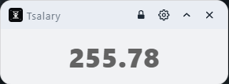
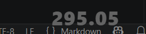
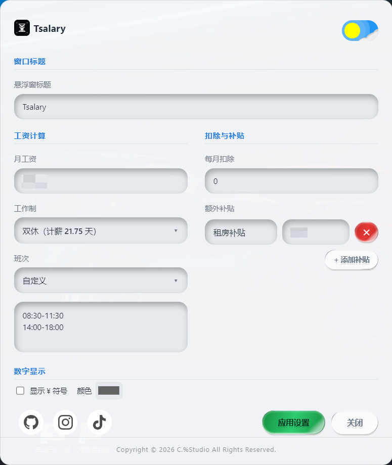

# Tsalary

**悬浮实时工资浮窗** —— 桌面右下角常驻小窗，每秒刷新

## 快速上手

### 1. 下载

**[👉 直接下载最新版 Tsalary.exe（v1.2.4）](https://github.com/kamswong/Tsalary/releases/latest/download/Tsalary.exe)**

或访问 [完整 Releases 页面](https://github.com/kamswong/Tsalary/releases) 查看历史版本。

### 2. 运行

双击 `Tsalary.exe`，无需安装即可使用，如需添加到桌面，右键菜单内点击新建快捷方式，再移动到桌面即可

### 3. 配置参数

1. 点击托盘图标 → **设置**，或者直接右键托盘图标选择**设置**
2. 依次填写：

   * **月工资**：税前或税后，随你喜欢

   * **工作制**：常见的是「双休」，也支持单休、月休、大小周、综合计时

   * **班次**：朝九晚六 / 朝九晚五 / 自定义
3. 点**保存设置**，回到悬浮窗即可看到实时跳动的金额

## 功能

* **秒级精度**：完整日期时间显示，直接时间差计算，没有小数误差

* **深色 / 浅色模式**：设置窗口右上角开关一键切换

* **自定义补贴**：餐补、交通补、房补……按天或按月加，都算进时薪里

* **低占用**：一个常驻小程序，基本感觉不到它的存在

## 怎么用

* **悬浮窗顶部**：左侧图标 / 标题，右侧置顶 / 设置 / 隐藏背景 / 关闭

* **点击数字区域**：展开/收起显示明细

* **长按拖动**：把悬浮窗挪到你喜欢的位置

* **点击托盘图标**：展开/收起悬浮窗

* **右键托盘图标**：显示悬浮窗 / 设置 / 退出

* **悬浮窗**：\
  

* **隐藏背景窗口**：\
  

* **设置窗口**：\
  

## 常见问题

**Q: 为什么一打开就开始算钱？**\
A: 只要你设置好工资参数，Tsalary 会自动按当前时间判断是否在上班时段内。不在上班时段时不会累加，也不会凭空扣你钱。

**Q: 关掉设置窗口后还会继续计时吗？**\
A: 会。设置窗口只是配置面板，关掉不影响悬浮窗运行。想彻底停掉，右键托盘 → **退出**。

**Q: 数据存哪里？会上传吗？**\
A: 所有设置和进度都只存在你本机，**不会上传任何数据**。

## 许可证

Copyright © 2026 C.%Studio All Rights Reserved.

```
           #######  ###################################  ###   ###        ######
          ##                           ###                ##             ##  ##
         ##       ###  ####    ####### ###   ##  ##       ##   ###      ##  ##
        ##            ##      ##       ###   ##  ##    #####    ##     ##  ##
       ##            ##      #######   ###   ##  ##   ##  ##    ##    ##  ##
      ##            ##           ##    ###   ##  ##   ##  ##    ##   ##  ##
     ########  ##  ##  ##  #######     ###   ######   ######   ###  ###### C.%Studio Kams
```

